# Faza 6 — przygotowanie HomeHub pod asystenta głosowego

Data: 2026-10-04. Baza: `03cbaa02f14f1d34a7bc772a91c70423cb5e310f`.
To rekomendacje do zatwierdzenia, nie implementacja. Nie dodano AI, pakietów,
usług, konfiguracji audio ani połączeń z urządzeniami. Nazwy nowych komponentów
poniżej są propozycjami, nie opisem istniejących plików.

## Rekomendowany pierwszy wariant

ReSpeaker Lite przez USB do istniejącego Raspberry Pi 5. Rozpocząć od przycisku
„Mów” w QML i krótkiej wypowiedzi po polsku. Osobny proces obsługuje kosztowne
rozpoznawanie i syntezę; HomeHub zachowuje wyłączną kontrolę nad urządzeniami.
Na początek deterministyczne rozpoznawanie kilku intencji, bez LLM, wake word,
stałego nagrywania, nowego serwera HTTP i nowych frameworków aplikacyjnych.

Pierwszy prototyp tylko odczytuje stan, np. „Jaka temperatura w łazience?”.
Dopiero kolejny etap, po zatwierdzeniu testów, dodaje zasilanie AC i temperaturę
w konkretnym pokoju. Asystent ma być opcjonalnym dodatkiem: jego brak lub awaria
nie mogą blokować panelu, MQTT, urządzeń ani uruchomienia aplikacji.

## Stan faktyczny i miejsca integracji

| Obecny kod | Rola i zalecane wykorzystanie |
| --- | --- |
| `View/main.py` | QGuiApplication + qasync, start i shutdown. Nie uruchamiać tu rozpoznawania w wątku UI. |
| `Compositions/compositions.py`, `App/lifecycle.py` | Tworzenie klientów i przenoszenie zasobów przez AsyncExitStack. Opcjonalny koordynator głosu podłączyć tutaj dopiero po jego testach. |
| `Interface/qt_backend.py` | Obecne komendy, walidacja, blokady OFF, sygnały busy/stale i wyniki dla QML. Tu znajduje się logika, której głos nie może omijać. |
| `App/operations.py` | OperationCoordinator i run_blocking. Zachować jednego właściciela transportu dla głosu, panelu i odświeżania. |
| `App/climate_service.py` | Usługi AC i confirm_ac_power. Ponawiać odczyty, nie niepewne komendy. |
| `App/water_heater_service.py`, `App/heater_service.py` | Istniejące operacje bojlera/grzejników; nie duplikować ich w asystencie. |
| `App/device_snapshot.py` | Spójny snapshot z confirmed_at dla bojlera i grzejników. Nie zakładać, że każde urządzenie ma już taki sam model świeżości. |
| `App/sensor_service.py`, `Adapters/zigbee_sensor_adapter.py` | Odbiór MQTT działa niezależnie od popupu. Dla odpowiedzi głosowej potrzebna jest także informacja o wieku ostatniego pomiaru. |
| `Ports/`, `Adapters/` | Wzorzec małych interfejsów i wymiennych implementacji. Zastosować również do audio/STT/TTS. |
| `Compositions/demo.py`, `Tests/run_offline.py` | Atrapy urządzeń i izolowane testy. Nie używać produkcyjnego composition root w testach głosu. |

## Przepływ

```mermaid
flowchart LR
    USB[ReSpeaker Lite USB] --> Capture[Bufor audio + koniec wypowiedzi]
    Capture --> STT[Proces STT]
    STT --> Intent[Interpretacja intencji]
    Intent --> Policy[Walidacja i ewentualne potwierdzenie]
    QML[Panel QML] --> Commands[Wspólne API komend HomeHub]
    Policy --> Commands
    Commands --> Operations[Istniejący OperationCoordinator]
    Operations --> Services[Usługi App i adaptery]
    Services --> Readback[Odczyt potwierdzający / wynik niepewny]
    Readback --> QML
    Readback --> Reply[Tekst odpowiedzi]
    Reply --> TTS[Proces TTS i odtwarzanie]
```



Nie przekazywać surowego audio przez sygnały QML ani przez MQTT urządzeń.
W lokalnej wersji wystarczy kontrolowany proces potomny z komunikatami przez
stdin/stdout, identyfikatorami żądań i ograniczoną długością komunikatów.
Osobne gniazdo lub serwer dopiero wtedy, gdy pojawi się rzeczywista potrzeba.

## ReSpeaker Lite i audio

Producent dokumentuje obsługę USB na Raspberry Pi oraz odrębne firmware USB
i I2S. Dla tej aplikacji rekomenduję USB; najpierw ustalić dokładną wersję płytki
i firmware, nie aktualizować ich „na wszelki wypadek”. Mikrofon nie zastępuje
silnika rozpoznawania tekstu i intencji. [Dokumentacja Seeed](https://wiki.seeedstudio.com/reSpeaker_usb_v3/)

Przyszły `AudioInputPort` udostępnia ramki PCM i zdarzenia odłączenia; adapter
wybiera konkretne urządzenie, nie przypadkowy domyślny mikrofon. Przed wyborem
biblioteki sprawdzić dostępne formaty na Pi. Format wewnętrzny proponuję mono
PCM 16 kHz, z konwersją tylko jeśli urządzenie jej wymaga. Nazwy kart i numery
kanałów muszą wynikać z rzeczywistej enumeracji, nie ze stałego indeksu 0.

Przycisk rozpoczyna nagranie, zwolnienie lub detekcja ciszy je kończy;
proponowany limit jednej wypowiedzi: 10 s. Bufor ograniczony rozmiarem i czasem,
bez zapisu nagrań na dysk domyślnie. Odłączenie USB kończy sesję z komunikatem,
bez wykonania częściowo rozpoznanej komendy. Stan mikrofonu widoczny w QML.

Wyjście audio wymaga wskazania głośnika — nie zakładać, że użytkownik już go ma.
Pierwszy wariant nie nasłuchuje podczas TTS (half-duplex), żeby własna odpowiedź
nie stała się komendą. Pełny dupleks i echo cancellation wymagają osobnego
testu toru mikrofon–głośnik, niezależnie od deklarowanych funkcji sprzętu.

## Rozpoznawanie mowy, synteza i opcjonalny model

| Element | Propozycja do pomiarów | Ograniczenie |
| --- | --- | --- |
| STT lokalne | whisper.cpp, porównanie modeli wielojęzycznych tiny i base na własnych polskich frazach | Nie wybierać wariantów `.en` dla polskiego. Brak potwierdzonej latencji na tym Pi. |
| TTS lokalne | Piper z wybranym polskim głosem | Przed wyborem sprawdzić kartę i licencję konkretnego głosu, wymowę nazw pokoi i obciążenie. |
| Intencje | Reguły + słownik nazw urządzeń/pokoi, jawna lista operacji | Najprostszy start, łatwy do przetestowania; nie rozumie dowolnej rozmowy. |
| LLM opcjonalny | Osobny adapter, np. silnik llama.cpp i później dobrany model | Model proponuje ustrukturyzowaną intencję, nigdy nie wykonuje kodu ani komend samodzielnie. |

Źródła projektów: [whisper.cpp](https://github.com/ggml-org/whisper.cpp),
[Piper](https://github.com/OHF-Voice/piper1-gpl),
[llama.cpp](https://github.com/ggml-org/llama.cpp). To kandydaci do prototypu,
nie zatwierdzone zależności produkcji. Nie wykonano benchmarku ani instalacji.

STT/TTS/LLM powinny mieć własny proces, limit czasu i kolejkę maksymalnie jednej
aktywnej wypowiedzi. Pozwala to zatrzymać zawieszoną inferencję bez blokowania Qt.
Nie kopiować polityki run_blocking urządzeń na proces modelu: przerwanie modelu
jest dopuszczalne, ale nie oznacza cofnięcia wysłanej już komendy urządzenia.
Nie uruchamiać jednocześnie STT i LLM bez pomiaru RAM, CPU, temperatury SoC
i wpływu na UI. Ciężkie modele poza podstawowym requirements.txt i binarium
PyInstaller; osobny, przypięty zestaw zależności oraz sprawdzone sumy modeli.

Chmura może być późniejszym zamiennikiem STT/interpretacji, dopiero po decyzji
o wysyłaniu dźwięku/tekstu i kosztach. Bez automatycznego przełączania z lokalnej
obsługi na chmurę. Brak Internetu nie może wywołać przypadkowej operacji.

## Wspólne, bezpieczne wywoływanie HomeHub

Nie wywoływać bezpośrednio metod adapterów ani losowych slotów Qt na podstawie
tekstu. Sam ClimateService nie zawiera wszystkich zabezpieczeń backendu.
Rekomendowana mała zmiana przed sterowaniem głosem: wydzielić z backendu
do `App` tylko potrzebne przypadki użycia z walidacją i wynikiem operacji.
QtHomeBackend pozostaje adapterem sygnałów; głos i QML korzystają z tej samej
instancji wykonawczej, koordynatora i kluczy zasobów (Atlantic nadal shared).
Przenosić po jednej operacji, bez przebudowy wszystkich integracji.

Przykładowy przyszły kontrakt, nie gotowe API:

```json
{"request_id":"unikalny-identyfikator","action":"ac.set_power","room":"Salon","arguments":{"on":true},"source":"voice"}
```

Wynik: request_id, device, status oraz odczyt i jego wiek; statusy co najmniej
rejected, pending, confirmed, unconfirmed, failed. Dzisiejsze sygnały finished
nie mają request_id, a sukces ustawień często oznacza wysłanie i odświeżenie,
nie porównanie każdej wartości. Nie tłumaczyć tego automatycznie na „wykonano”.

Zasady dla pierwszych komend:

- Jawne `set_power(true/false)`, nigdy „toggle” wywnioskowany ze starego cache.
- Pokój i urządzenie z listy konfiguracji. „Włącz klimatyzację” przy dwóch AC
  wymaga doprecyzowania, nie wyboru pierwszego urządzenia.
- Temperatury, tryby i pozycje nawiewu zgodne z istniejącymi walidacjami
  i aktualnie odczytanymi możliwościami SDK. Nie rozszerzać limitów dla głosu.
- Przy OFF zapis ustawień AC pozostaje zablokowany. Nie włączać urządzenia
  ukrytym krokiem po poleceniu zmiany temperatury.
- Brak danych / nieaktualny stan to jawna odpowiedź, nie wymyślone zero.
  Dla MQTT potrzebny przyszły timestamp ostatniej wiadomości; obecny cache
  nie wystarcza do odpowiedzi „teraz jest ...”. Retain też nie dowodzi świeżości.
- Niejednoznaczna transkrypcja: pytanie lub odrzucenie. W pierwszym etapie
  zapisy wymagają potwierdzenia na ekranie; odczyty nie. Politykę późniejszego
  samodzielnego sterowania głosem ustalić z użytkownikiem.
- Wynik modelu jest niezaufanym wejściem. Walidacja schematu, listy akcji,
  pokoju i wartości jest obowiązkowa; bez eval, shell, dowolnych URL i metod.
- To samo request_id nie wykonuje komendy drugi raz. Po restarcie procesu
  nie odtwarzać zapisów z kolejki; najpierw odczytać stan urządzenia.
- Timeout: „Nie potwierdziłem zmiany”, odczyt uzgadniający jak obecnie,
  bez automatycznego ponawiania zapisu. Anulowanie głosu nie cofa urządzenia.
- Potwierdzenie użytkownika wiązać z konkretną operacją i krótkim terminem
  ważności; zmiana pokoju/wartości unieważnia wcześniejszą zgodę.

Na start lista funkcji: odczyt temperatury łazienki, odczyt stanu AC,
następnie zasilanie i temperatura AC. Bojler, grzejniki i polecenia zbiorcze
dodać później po osobnych testach. Pralka pozostaje monitorem, nie zakładać
istnienia komend uruchamiania prania.

## QML, cykl życia i konfiguracja

Proponowane stany głosu: wyłączony, gotowy, słuchanie, przetwarzanie,
oczekiwanie na potwierdzenie, wykonywanie, odpowiedź, błąd. QML otrzymuje krótkie
sygnały ze stanem, transkrypcją i request_id; aktualizacja wyłącznie na pętli Qt.
Wątek audio przekazuje pracę przez thread-safe kolejkę/scheduler, nie zmienia
bezpośrednio kontrolek. Panel manualny działa również podczas awarii głosu.

Start audio/modelu dopiero po uruchomieniu podstawowego HomeHub, domyślnie
wyłączony. Rejestracja zasobów przez istniejący lifecycle; błąd audio nie może
wycofać działających klientów urządzeń. Zamykanie: zablokować nowe sesje,
przerwać przechwytywanie i oczekujące intencje, zatrzymać TTS/workery, zamknąć
audio; trwającą komendę urządzenia kończy istniejący koordynator.

Przed integracją głosu trzeba odtworzyć i naprawić na rzeczywistym Pi
`Event loop stopped before Future completed` przy zamykaniu. Restart=no
z PR #20 usuwa samoczynne otwieranie okna, ale nie naprawia cleanup.
Głos nie powinien zwiększać liczby zasobów przy tym znanym błędzie.

Przyszłe ustawienia: feature flag, identyfikator wejścia/wyjścia, język,
lokalizacje modeli i limity sesji. Użyć obecnego loadera konfiguracji z przykładami,
bez sekretów w QML i repo. Mikrofon wyłączalny w UI; nagrania/transkrypcje
domyślnie nietrwałe. Logi operacji: request_id, akcja, wynik i czas,
bez pełnych rozmów i danych uwierzytelniających.

## Małe etapy przyszłej implementacji

1. `fix/qt-shutdown`: odtworzenie i test rzeczywistego zamknięcia Pi, bez AI.
2. `feature/audio-probe`: wykrycie ReSpeaker i test nagrania/odtwarzania
   w izolowanym środowisku, bez klientów urządzeń i bez modeli.
3. `feature/voice-readonly`: przycisk, STT, reguły i odczyt stanu na demo,
   potem TTS; pomiary wydajności na Pi przed wyborem modeli.
4. `feature/command-api`: wydzielenie pojedynczej komendy AC ze wspólną
   walidacją, korelacją i readbackiem; regresje dotychczasowego QML.
5. `feature/voice-ac`: podłączenie tej komendy i potwierdzenia ekranowego,
   testy offline, następnie uzgodniony scenariusz jednego fizycznego AC.
6. Dopiero opcjonalnie wake word i/lub lokalny LLM. Ich wybór wymaga osobnej
   oceny jakości polskiego, fałszywych aktywacji, zasobów i prywatności.

Każdy etap oddzielny PR, bez nowych frameworków. W fazie 6 żaden nie jest
implementowany. Proponowana kolejność nie upoważnia do nagrywania użytkownika
ani sterowania urządzeniami.

## Weryfikacja przyszłej funkcji

| Test | Warunek zaliczenia |
| --- | --- |
| Syntetyczna transkrypcja → intencja | Pokój/liczba/jednostka poprawne; negacja, nieznany pokój i niejednoznaczność nie wysyłają komendy. |
| Głos + dotyk + timer jednocześnie | Jedna wspólna koordynacja, bez równoległych zapisów do współdzielonego transportu. |
| OFF, timeout, utrata chmury, inny readback | Zachowane blokady i ostatni potwierdzony stan; odpowiedź nie ogłasza sukcesu. |
| Duplikat, anulowanie, restart workera | Brak powtórzenia zapisu; panel nadal działa. |
| Stary/brakujący pomiar MQTT | Odpowiedź rozróżnia brak danych i ostatni znany pomiar; brak sztucznego zera. |
| QML headless | Przyciski i stany sesji działają z fake audio/STT/TTS, bez mikrofonu i modeli. |
| Odłączenie USB / zajęta karta | Błąd tylko modułu głosu, bez awarii HomeHub i zapisów do urządzeń. |
| Zamknięcie aplikacji | Procesy audio/modeli i uchwyty kończą się, bez błędu pętli i samoczynnego startu. |
| Pi pod obciążeniem | Zmierzone opóźnienia p50/p95, RAM/CPU i responsywność dotyku; brak pogorszenia obsługi komend i MQTT. |

Zachować OfflineGuard. Obecny guard blokuje subprocess: w testach jednostkowych
wstrzykiwać fake workery zamiast go wyłączać. Rzeczywisty test procesu modelu
i plików audio uruchamiać jako osobny, izolowany test bez sekretów i sieci,
nie jako obejście zabezpieczeń bieżącej suite. Nagrania tylko syntetyczne
lub za zgodą, z określoną licencją. Nie ustanawiać progów wydajności jako
„osiągniętych” przed pomiarami na Pi.

## Stan gotowości i nieweryfikowane elementy

Użytkownik potwierdził działanie AC, pozycji nawiewu i — po usunięciu oraz
ponownym dodaniu czujnika Zigbee — odczytów w HomeHub. To ręczne potwierdzenie
użytkownika, nie test sprzętowy wykonany przez agenta. Nie ustalono dokładnej
przyczyny braku raportowania przed ponownym dodaniem czujnika.

Pozostają: błąd zamykania qasync, brak pełnego locka produkcyjnego (potwierdzono
pyairstage 2.4.0 na Pi), nieprzetestowany rollback artefaktu i ograniczony
healthcheck wdrożenia. Nie zatrzymują przygotowania tego planu; nie należy
ich przedstawiać jako zamkniętych przez dokumentację.

Nie zweryfikowano fizycznego ReSpeaker, firmware, toru wyjściowego, urządzeń
audio w systemie, skuteczności polskiego STT/TTS ani wydajności modelu na Pi.
Do zatwierdzenia: powyższy kierunek (USB, push-to-talk, lokalnie, najpierw
odczyty, LLM opcjonalny) i rozpoczęcie osobnego etapu implementacji.
